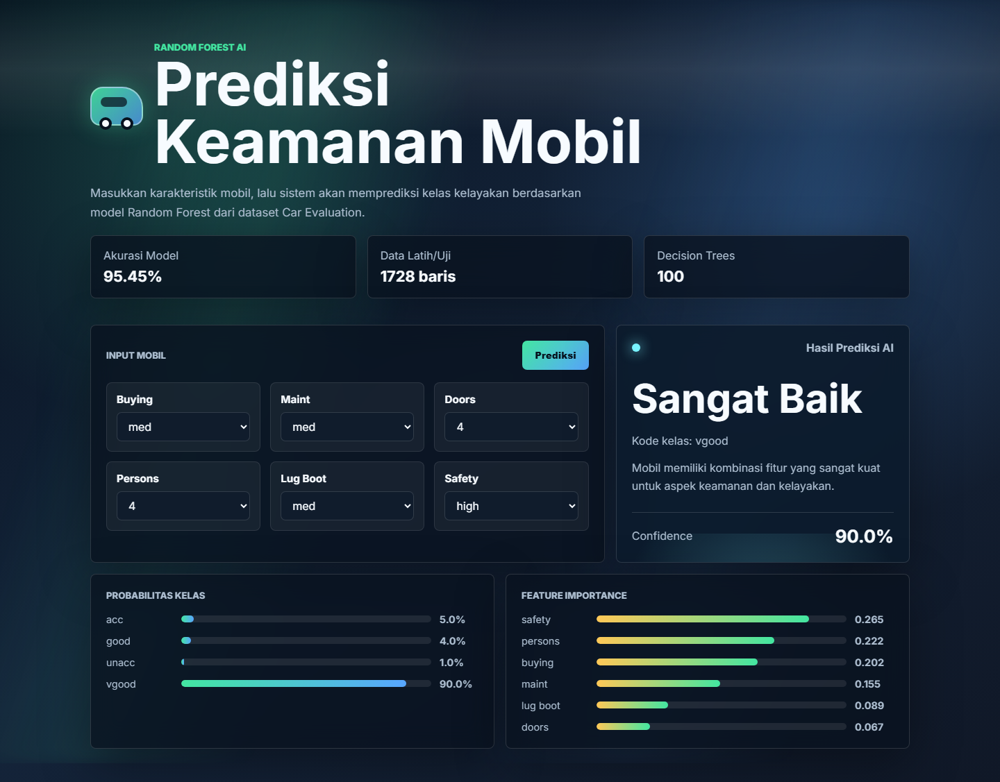

# Prediksi Keamanan Mobil by AI

Web ini dibuat dari model machine learning pada notebook `Tugas_Kelompok_2_DataSet.ipynb`.
Aplikasi menerima input karakteristik mobil, lalu menjalankan model AI untuk memprediksi kelas
kelayakan atau keamanan mobil.

## Fitur Web

- Form prediksi untuk fitur `buying`, `maint`, `doors`, `persons`, `lug_boot`, dan `safety`.
- Model AI berjalan langsung dari backend Flask, bukan tampilan dummy.
- Hasil prediksi menampilkan label kelas, kode kelas, confidence, dan probabilitas setiap kelas.
- Dashboard kecil untuk akurasi model dan feature importance.
- UI memakai background animasi, logo mobil, panel transparan, dan bar animasi agar tidak terlihat polos.

## Penjelasan Model AI

Model yang digunakan adalah `RandomForestClassifier` dari scikit-learn dengan `n_estimators=100`
dan `random_state=0`, mengikuti pendekatan terbaik pada notebook project ini. Dataset yang dipakai
adalah Car Evaluation dataset dengan 1.728 baris data.

Fitur input:

- `buying`: harga pembelian mobil (`vhigh`, `high`, `med`, `low`)
- `maint`: biaya perawatan (`vhigh`, `high`, `med`, `low`)
- `doors`: jumlah pintu (`2`, `3`, `4`, `5more`)
- `persons`: kapasitas penumpang (`2`, `4`, `more`)
- `lug_boot`: ukuran bagasi (`small`, `med`, `big`)
- `safety`: tingkat keamanan (`low`, `med`, `high`)

Kelas output:

- `unacc`: tidak layak
- `acc`: layak
- `good`: baik
- `vgood`: sangat baik

Pipeline model:

1. Dataset dibaca dari `data/car.data`. Jika belum ada, aplikasi mengunduh dataset dari UCI.
2. Fitur kategori diproses dengan `OrdinalEncoder`.
3. Data dibagi memakai `train_test_split(test_size=0.33, random_state=42)`.
4. Model `RandomForestClassifier(n_estimators=100, random_state=0)` dilatih.
5. Model dan metrik disimpan ke folder `models/` dalam format `joblib`.

Hasil verifikasi lokal saat README ini diperbarui:

- Akurasi test: `95.45%`
- Total dataset: `1728` baris
- Jumlah data test: `571` baris
- Fitur paling berpengaruh: `safety`, `persons`, `buying`, `maint`, `lug_boot`, `doors`

## Tech Web

- Backend: Flask
- Machine learning: scikit-learn
- Data processing: pandas
- Model persistence: joblib
- Frontend: HTML, CSS, JavaScript
- Visual: CSS animated background, logo mobil CSS, glass panel, probability bars
- Testing: pytest dan Flask test client

## Cara Menjalankan

Install dependency:

```powershell
python -m pip install -r requirements.txt
```

Latih model dan jalankan web:

```powershell
python run.py
```

Jika port `5000` sedang dipakai aplikasi lain:

```powershell
$env:PORT='5789'; python run.py
```

Buka di browser:

```text
http://127.0.0.1:5000
```

atau sesuai port yang dipilih, misalnya:

```text
http://127.0.0.1:5789
```

## Testing

Jalankan test:

```powershell
$env:PYTEST_DISABLE_PLUGIN_AUTOLOAD='1'; python -m pytest -q
```

Catatan: environment lokal ini memiliki plugin pytest global yang bentrok sebelum test project berjalan,
jadi `PYTEST_DISABLE_PLUGIN_AUTOLOAD=1` dipakai agar pytest hanya menjalankan test project ini.

Hasil test lokal:

```text
3 passed in 3.23s
```

## Screenshot Evidence

Screenshot berikut diambil dari aplikasi Flask yang berjalan di `http://127.0.0.1:5789/`
menggunakan Playwright. Verifikasi screenshot memastikan halaman berjudul
`Prediksi Keamanan Mobil AI` dan panel `Hasil Prediksi AI` muncul.


